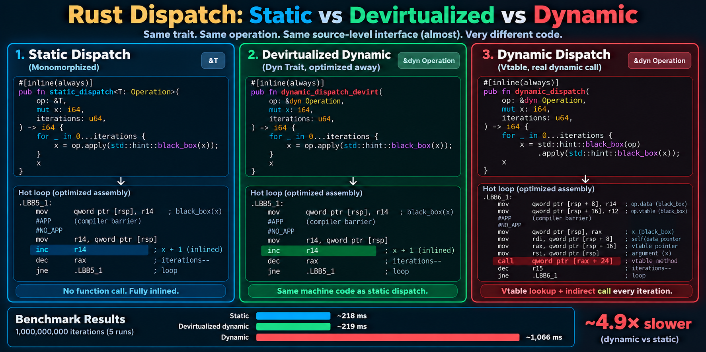

# Rust Static vs Dynamic Dispatch Benchmark

<p align="center">
  
</p>

A small experiment demonstrating the difference between **static trait dispatch** and **dynamic trait dispatch** in optimized Rust code.

The benchmark uses the same trait operation in two forms:

Inlined and monomorphized:

```rust
&T
```

and vtable dynamic dispatch:

```rust
&dyn Operation
```

The static version is monomorphized and allows the trait method to be inlined into the benchmark loop.

The dynamic version is deliberately kept across a crate boundary with LTO disabled, forcing a real vtable dispatch.

## Running the benchmark

Clone the repository and run the benchmark in release mode:

```bash
git clone https://github.com/amidukr/rust-devirtualization-test.git
cd rust-devirtualization-test
cargo run --release -p devirtualization-test-main
```

On the test machine, the resulting benchmark is approximately:

- CPU: 12th Gen Intel(R) Core(TM) i7-1255U (Low-Power Laptop CPU)
- Power Mode: Balanced

```text
Iterations: 1000000000

run 1: static =  261.645 ms | dynamic =  867.913 ms | dynamic/static = 3.32x
run 2: static =  251.855 ms | dynamic =  871.570 ms | dynamic/static = 3.46x
run 3: static =  245.499 ms | dynamic =  869.815 ms | dynamic/static = 3.54x
run 4: static =  253.843 ms | dynamic =  874.743 ms | dynamic/static = 3.45x
run 5: static =  242.746 ms | dynamic =  871.301 ms | dynamic/static = 3.59x
```

In this experiment, dynamic dispatch is therefore roughly **3.5× slower** than the statically dispatched and inlined version.

This is a deliberately small microbenchmark. It should not be interpreted as saying that Rust programs using `dyn Trait` are generally 3.5× slower. The purpose is to make the generated machine-code difference easy to observe.

## Project structure

```text
.
├── Cargo.lock
├── Cargo.toml
├── docs
│   └── assets
│       ├── lib.asm
│       └── main.asm
├── lib-crate
│   ├── Cargo.toml
│   └── src
│       └── lib.rs
├── main-crate
│   ├── Cargo.toml
│   └── src
│       └── main.rs
└── README.md
```

The experiment is split into two crates intentionally.

`lib-crate` contains the trait and the dynamic dispatch function. `main-crate` contains the concrete implementation and invokes the benchmark.

Keeping `dynamic_dispatch` in another crate while building without LTO prevents LLVM from seeing enough information to devirtualize the `dyn Operation` call.

The generic static version is different. Rust monomorphizes the generic function for the concrete `AddOne` type, allowing LLVM to optimize it specifically for that implementation.

## The trait

The benchmark uses a deliberately trivial operation:

```rust
pub trait Operation {
    fn apply(&self, x: i64) -> i64;
}

pub struct AddOne;

impl Operation for AddOne {
    #[inline(always)]
    fn apply(&self, x: i64) -> i64 {
        x + 1
    }
}
```

The simplicity is intentional: it makes the dispatch overhead and generated assembly easy to see.

## Static dispatch

The static version is generic:

```rust
#[inline(never)]
pub fn static_dispatch<T: Operation>(
    op: &T,
    mut x: i64,
    iterations: u64,
) -> i64 {
    for _ in 0..iterations {
        x = op.apply(std::hint::black_box(x));
    }

    x
}
```

At the Rust source level this function works with any `T: Operation`.

At the machine-code level, however, Rust generates a specialized version for the concrete type used by the caller:

```text
static_dispatch::<AddOne>
```

This can be seen directly in the mangled symbol name:

```text
_RINvCs85WuWpnC3RJ_25devirtualization_test_lib15static_dispatchNtB2_6AddOneECsgqu5hhwAJIh_26devirtualization_test_main
```

The important pieces embedded in the symbol are:

```text
devirtualization_test_lib
static_dispatch
AddOne
```

The resulting optimized assembly is:

```asm
mov     rax, rdi
test    rsi, rsi
je      .LBB0_3
lea     rcx, [rsp - 8]
.p2align 4

.LBB0_2:
mov     qword ptr [rsp - 8], rax

# black_box compiler barrier

mov     rax, qword ptr [rsp - 8]
inc     rax
dec     rsi
jne     .LBB0_2

.LBB0_3:
ret
```

The important instruction is:

```asm
inc rax
```

That is the complete inlined implementation of:

```rust
op.apply(x)
```

for:

```rust
AddOne::apply(x)
```

There is no function call, function pointer, or vtable lookup in the hot loop.

The concrete type is known, so the compiler has transformed:

```rust
op.apply(x)
```

into essentially:

```rust
x += 1;
```

### Why `black_box` is inside the loop

Without `black_box`, LLVM can optimize the entire loop away.

For example:

```rust
for _ in 0..iterations {
    x = x + 1;
}
```

is mathematically equivalent to:

```rust
x + iterations
```

LLVM recognizes this and can reduce one billion iterations to approximately:

```asm
lea rax, [rdi + rsi]
ret
```

That would make the benchmark meaningless.

Instead, the benchmark uses:

```rust
x = op.apply(std::hint::black_box(x));
```

The value of `x` becomes opaque to the optimizer on each iteration, preventing LLVM from collapsing the iterations into one addition.

At the same time, `apply()` itself remains visible to the optimizer and can still be inlined.

This gives us the behavior we want:

```asm
inc rax
```

executed once per iteration.

## Dynamic dispatch

The dynamic version operates on a trait object:

```rust
#[inline(never)]
pub fn dynamic_dispatch(
    op: &dyn Operation,
    mut x: i64,
    iterations: u64,
) -> i64 {
    for _ in 0..iterations {
        x = op.apply(x);
    }

    x
}
```

Because `&dyn Operation` is a trait object, the function effectively receives two pointers:

```text
data pointer
vtable pointer
```

On x86-64 System V, the effective arguments in this benchmark are:

```text
RDI = op.data
RSI = op.vtable
RDX = x
RCX = iterations
```

The optimized library assembly is:

```asm
mov     rax, rdx
test    rcx, rcx
je      .LBB0_4

push    r15
push    r14
push    rbx

mov     rbx, rcx
mov     r14, rdi

mov     r15, qword ptr [rsi + 24]

.p2align 4

.LBB0_2:
mov     rdi, r14
mov     rsi, rax
call    r15
dec     rbx
jne     .LBB0_2

pop     rbx
pop     r14
pop     r15

.LBB0_4:
ret
```

The key instructions are:

```asm
mov r15, qword ptr [rsi + 24]
```

followed by:

```asm
call r15
```

`RSI` contains the vtable pointer.

Therefore:

```asm
mov r15, qword ptr [rsi + 24]
```

loads the `Operation::apply` function pointer from the vtable.

LLVM then keeps that function pointer in `r15`.

This is worth noting: the compiler has already optimized the vtable lookup **out of the loop**.

It does not execute:

```asm
call qword ptr [vtable + 24]
```

one billion times.

Instead, it effectively performs:

```asm
mov r15, qword ptr [vtable + 24]

.loop:
    call r15
```

The dynamic version is therefore already reasonably optimized.

What LLVM cannot do without devirtualizing the call is replace:

```asm
call r15
```

with the actual implementation.

## The called implementation

The dynamically called `AddOne::apply` itself is extremely small:

```asm
lea     rax, [rsi + 1]
ret
```

So the dynamic hot path is effectively:

```asm
.loop:
    mov     rdi, r14
    mov     rsi, rax
    call    r15

        ; AddOne::apply
        lea     rax, [rsi + 1]
        ret

    dec     rbx
    jne     .loop
```

while static dispatch has effectively become:

```asm
.loop:
    ; black_box barrier
    inc     rax
    dec     rsi
    jne     .loop
```

That is the core of this experiment.

## Static vs dynamic assembly

Ignoring the `black_box` compiler barrier, the hot loops can be summarized as:

```text
STATIC                           DYNAMIC

                                mov rdi, r14
                                mov rsi, rax
inc rax                         call r15
                                    lea rax, [rsi + 1]
                                    ret

dec rsi                         dec rbx
jne loop                        jne loop
```

Static dispatch allows `AddOne::apply` to become part of the caller.

Dynamic dispatch preserves a function-call boundary.

The cost is therefore not merely a vtable memory lookup. In this example LLVM already hoists the vtable lookup outside the loop.

The important remaining difference is that static dispatch enables the operation itself to be **inlined and optimized together with its caller**, while dynamic dispatch requires an indirect call and return on every iteration.

## A note about GOT calls

The main crate calls the library function with assembly similar to:

```asm
call qword ptr [rip + dynamic_dispatch@GOTPCREL]
```

This should **not** be confused with trait dynamic dispatch.

`GOTPCREL` is normal ELF position-independent linking through the Global Offset Table.

Semantically, the target is still the specific named function:

```text
dynamic_dispatch
```

The actual trait dispatch occurs later, inside that function:

```asm
mov     r15, qword ptr [rsi + 24]
...
call    r15
```

This distinction is important when looking for dynamic dispatch in generated assembly.

For example:

```asm
call qword ptr [rip + foo@GOTPCREL]
```

is a call to a known symbol through linker indirection.

By contrast:

```asm
call r15
```

or:

```asm
call qword ptr [rbx + 24]
```

can represent a runtime-selected call target.

## Running the benchmark

Build and run the release version from the workspace root:

```bash
cargo run --release -p devirtualization-test-main
```

Example output:

```text
Iterations: 1000000000

run 1: static =  261.645 ms | dynamic =  867.913 ms | dynamic/static = 3.32x
run 2: static =  251.855 ms | dynamic =  871.570 ms | dynamic/static = 3.46x
run 3: static =  245.499 ms | dynamic =  869.815 ms | dynamic/static = 3.54x
run 4: static =  253.843 ms | dynamic =  874.743 ms | dynamic/static = 3.45x
run 5: static =  242.746 ms | dynamic =  871.301 ms | dynamic/static = 3.59x
```

Results will vary by CPU, operating system, compiler version, CPU frequency scaling, and system load.

The assembly shown in this repository was generated with:

```text
rustc 1.98.1
```

## Generating the assembly

The checked-in assembly examples are stored in:

```text
docs/assets/main.asm
docs/assets/lib.asm
```

To generate Intel-syntax assembly for the library:

```bash
cargo rustc --release -p devirtualization-test-lib -- \
    --emit=asm -C llvm-args=-x86-asm-syntax=intel
```

To generate assembly for the main crate:

```bash
cargo rustc --release -p devirtualization-test-main -- \
    --emit=asm -C llvm-args=-x86-asm-syntax=intel
```

The generated `.s` files can be found under:

```text
target/release/deps/
```

For example:

```bash
find target/release/deps -name '*.s'
```

The files in `docs/assets/` are copies of these generated assembly files, kept in the repository so the generated code can be inspected without rebuilding it.

## Why two crates?

Putting the dynamic function into a separate crate is important to the experiment.

If LLVM can see both the caller and the concrete implementation, it may determine that the trait object can only contain `AddOne`.

It can then **devirtualize** the call.

In earlier experiments, LLVM was able to turn dynamic dispatch into a direct call when sufficient information was available.

That would defeat the purpose of this benchmark.

The workspace therefore disables LTO:

```toml
[profile.release]
lto = false
```

and places `dynamic_dispatch` across the crate boundary.

This keeps the dynamic dispatch genuinely dynamic.

The static generic function behaves differently because Rust monomorphizes:

```rust
static_dispatch::<AddOne>
```

for the concrete type.

The resulting specialized function is visible in the main crate's generated assembly.

## What this benchmark demonstrates

This benchmark does **not** attempt to establish a universal performance ratio between static and dynamic dispatch.

Instead, it demonstrates a specific optimization consequence of the two models.

With static dispatch:

```text
generic function
    ↓
monomorphization
    ↓
concrete implementation known
    ↓
method inlining
    ↓
inc rax
```

With dynamic dispatch:

```text
dyn Trait
    ↓
vtable
    ↓
function pointer
    ↓
indirect call
    ↓
separate AddOne::apply
    ↓
return
```

For this deliberately tiny operation, the difference is especially visible because the useful
